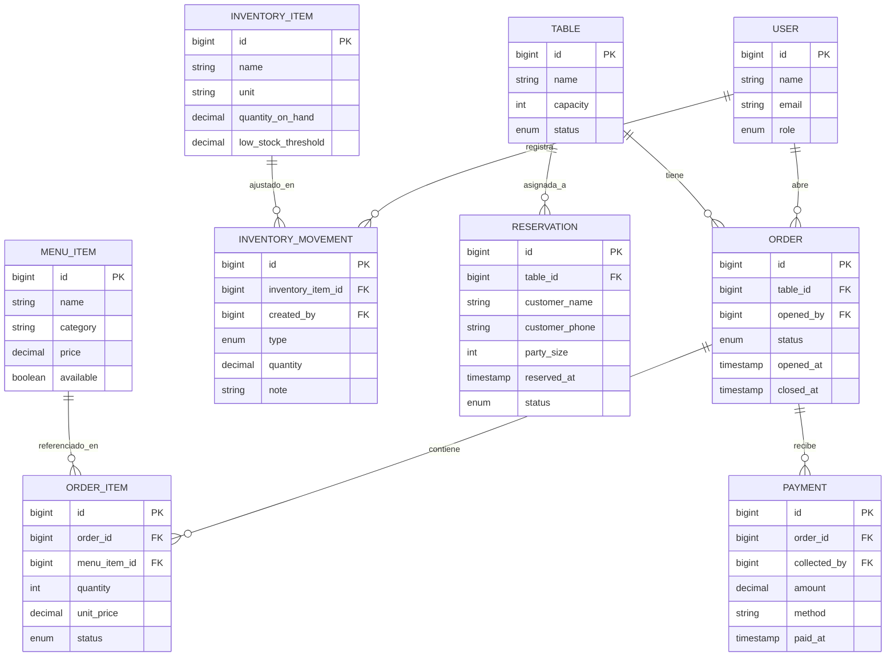

# Data Model — restaurante-os

> Deriva de las Épicas del PRD (`_ai/docs/PRD.md`), de ADR-002 (PostgreSQL en
> producción) y de ADR-006 (multi-tenancy vía stancl/tenancy, multi-DB). Alimenta
> migraciones y modelos Eloquent.

## Tenancy: una sola base, aislada por `tenant_id`

Con ADR-006 este sistema es un SaaS single-database: **todos los restaurantes
comparten la misma base de datos** y se aíslan por una columna `tenant_id`.

### Entidades de tenancy (provistas por `stancl/tenancy`)

| Entidad | Campos clave | Nota |
|---|---|---|
| `Tenant` | `id` (string/uuid), `data` (json) | Un registro por restaurante-cliente |
| `Domain` | `domain` (ej. `elancla`), `tenant_id` | Mapea subdominio → tenant; usado por el middleware de identificación |

### Regla que aplica a TODAS las entidades de abajo

Cada tabla del dominio lleva **`tenant_id`** (FK → `tenants.id`, required), y cada
modelo Eloquent correspondiente usa el trait
`Stancl\Tenancy\Database\Concerns\BelongsToTenant`. El trait:
- aplica `TenantScope`, que inyecta `where tenant_id = ?` en toda query de Eloquent
- rellena `tenant_id` solo al crear un registro

Por legibilidad, `tenant_id` **no se repite** en cada tabla de abajo — se da por
hecho en todas. Las únicas excepciones serían tablas globales del sistema, y hoy
no hay ninguna.

> ⚠️ El scope NO protege queries crudas (`DB::table()`), `withoutTenancy()`, ni
> Jobs corriendo sin tenancy inicializada. Ver Consequences de ADR-006.

## Entidades del dominio (todas con `tenant_id`)

### User (extiende la tabla existente del starter kit)
| Campo | Tipo | Constraints |
|---|---|---|
| id | bigint | PK |
| name | string | required |
| email | string | required, unique |
| password | string | required |
| role | enum('admin','mesero','cocina') | required, default 'mesero' — ver ADR-003 |

### Table (Mesa)
| Campo | Tipo | Constraints |
|---|---|---|
| id | bigint | PK |
| name | string | required — ej. "Mesa 4" |
| capacity | unsignedInteger | required |
| status | enum('libre','ocupada','por_cobrar') | required, default 'libre' |

### MenuItem (Platillo)
| Campo | Tipo | Constraints |
|---|---|---|
| id | bigint | PK |
| name | string | required |
| category | string | required — string simple en MVP, no tabla propia (ver nota) |
| price | decimal(10,2) | required — nunca `float`, es dinero |
| available | boolean | required, default true |

**Nota de alcance:** `category` es un string, no una tabla `MenuCategory` separada.
El PRD (US-6.1) no pide gestión independiente de categorías (reordenar, iconos);
si eso aparece en un piloto real, se extrae a tabla — barato de hacer después,
caro de sobre-construir ahora.

### Order (Cuenta / Pedido de una mesa)
| Campo | Tipo | Constraints |
|---|---|---|
| id | bigint | PK |
| table_id | bigint | FK → tables, required |
| opened_by | bigint | FK → users, required |
| status | enum('abierta','enviada_cocina','lista','por_cobrar','pagada','cancelada') | required, default 'abierta' |
| opened_at | timestamp | required |
| closed_at | timestamp | nullable |

### OrderItem (pivot Order↔MenuItem con datos propios)
| Campo | Tipo | Constraints |
|---|---|---|
| id | bigint | PK |
| order_id | bigint | FK → orders, required |
| menu_item_id | bigint | FK → menu_items, required |
| quantity | unsignedInteger | required, default 1 |
| unit_price | decimal(10,2) | required — **snapshot** del precio al momento de agregarlo; no se recalcula si `menu_items.price` cambia después |
| status | enum('pendiente','preparando','listo','servido') | required, default 'pendiente' — lo que mueve el KDS (US-2.2) |

### Payment (Pago aplicado a una orden)
| Campo | Tipo | Constraints |
|---|---|---|
| id | bigint | PK |
| order_id | bigint | FK → orders, required |
| collected_by | bigint | FK → users, required — **quién cobró** (ver F-03 del threat model) |
| amount | decimal(10,2) | required |
| method | string | required — ej. "efectivo", "tarjeta" |
| paid_at | timestamp | required |

**`collected_by` es un control interno, no un metadato.** Sin él es imposible
responder "¿qué mesero tomó este pago en efectivo?", que es el control más
básico contra el vector de fraude más común en restaurantes. Agregado tras el
threat model del 2026-08-10 (F-03), donde se detectó que `InventoryMovement`
sí registraba `created_by` y `Payment` no — inconsistencia que delataba un
olvido, no una decisión.

**Nota de alcance:** se modela como 1:N (una orden puede tener varios pagos) desde
el día uno, aunque split-bill (US-3.2) sea `Could` y no se construya la UI todavía.
Retrofitting un pago 1:1→1:N después de tener datos reales en producción es mucho
más costoso que declarar la relación correcta ahora sin construir la UI que la usa.

### Reservation (Reserva)
| Campo | Tipo | Constraints |
|---|---|---|
| id | bigint | PK |
| table_id | bigint | FK → tables, nullable — se asigna al crear o después |
| customer_name | string | required |
| customer_phone | string | required |
| party_size | unsignedInteger | required |
| reserved_at | timestamp | required |
| status | enum('confirmada','sentada','cancelada') | required, default 'confirmada' |

### InventoryItem (Insumo)
| Campo | Tipo | Constraints |
|---|---|---|
| id | bigint | PK |
| name | string | required |
| unit | string | required — ej. "kg", "l", "unidad" |
| quantity_on_hand | decimal(10,3) | required, default 0 |
| low_stock_threshold | decimal(10,3) | required, default 0 |

### InventoryMovement (Ajuste manual de stock)
| Campo | Tipo | Constraints |
|---|---|---|
| id | bigint | PK |
| inventory_item_id | bigint | FK → inventory_items, required |
| type | enum('entrada','salida') | required |
| quantity | decimal(10,3) | required |
| note | string | nullable |
| created_by | bigint | FK → users, required |

## Relaciones

- `User` 1:N `Order` (vía `opened_by`)
- `User` 1:N `Payment` (vía `collected_by`)
- `Table` 1:N `Order`
- `Table` 1:N `Reservation` (FK nullable — reserva puede no tener mesa asignada aún)
- `Order` N:M `MenuItem` vía `OrderItem` (pivot con `quantity`, `unit_price`, `status`)
- `Order` 1:N `Payment`
- `InventoryItem` 1:N `InventoryMovement`
- `User` 1:N `InventoryMovement` (vía `created_by`)

## Índices recomendados

| Tabla | Índice | Por qué |
|---|---|---|
| orders | (`table_id`, `status`) | mapa de mesas filtra por mesa+estado constantemente |
| order_items | `order_id` | cargar ítems de una orden es la query más frecuente del POS |
| order_items | `status` | el KDS filtra por ítems pendientes/preparando en cada poll |
| payments | `order_id` | cerrar cuenta consulta pagos de esa orden |
| reservations | (`reserved_at`, `table_id`) | calendario de reservas ordena por hora |
| inventory_movements | `inventory_item_id` | historial de movimientos por insumo |

## Diagrama ERD

## Notas de migración

- **Toda tabla del dominio lleva `tenant_id`** con FK a `tenants.id` e índice
  (ver sección de tenancy arriba). Los índices compuestos listados abajo deberían
  además considerar `tenant_id` como primera columna, ya que toda query lo filtra.
- Todas las columnas de dinero usan `decimal(10,2)`, nunca `float` — evita errores
  de redondeo en cobros.
- `OrderItem.unit_price` es un snapshot deliberado — no se debe agregar una
  relación calculada que recupere el precio actual de `MenuItem`.
- Migraciones deben usar tipos portables de Laravel (no específicos de PostgreSQL)
  para que los tests sigan corriendo contra SQLite en CI, aunque producción use
  PostgreSQL (ver ADR-002).
